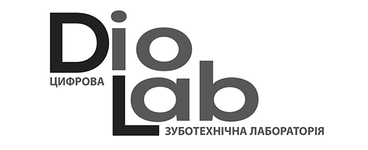
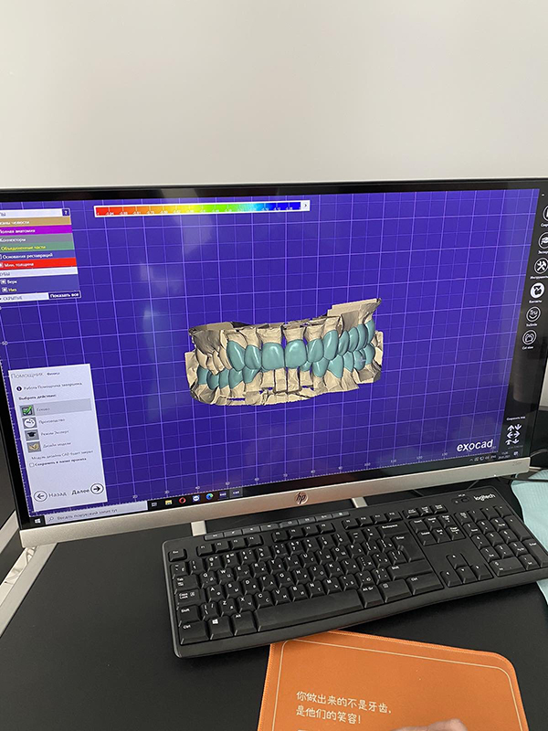
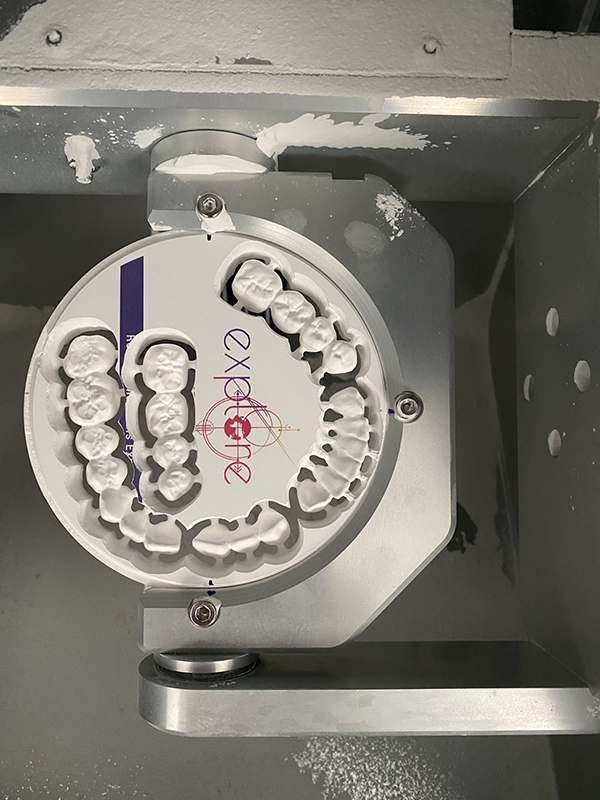
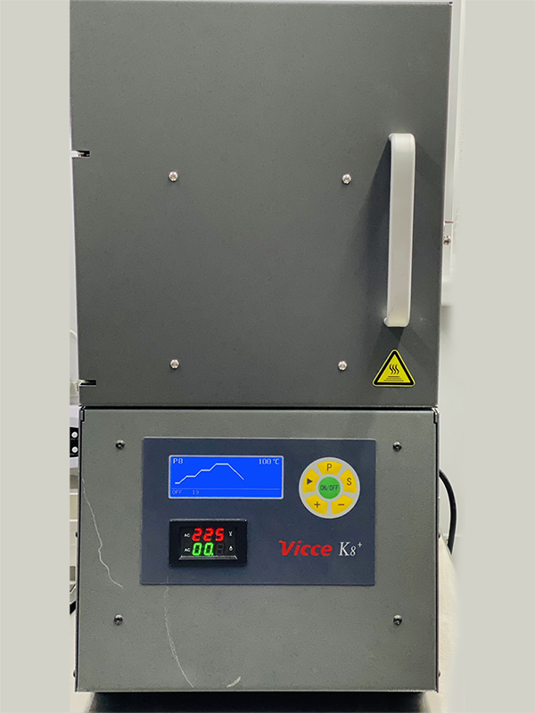
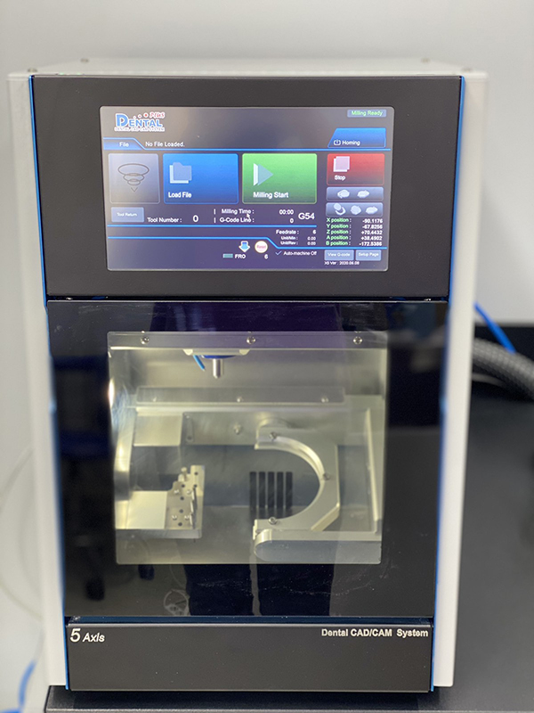
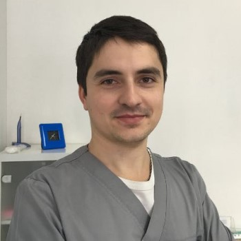
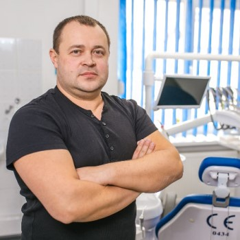

# Зуботехнічна лабораторія

### CAD / CAM

### Прайс для лікарів-стоматологів

Dio -Lab- зуботехнічна лабораторія повного виробничого циклу, що виготовляє ортопедичні конструкції за допомогою CAD/CAM-систем.

У власній фрезерній студіі ми виготовляємо безметалеві і металокерамічні коронки, роботи з опорою на імпланти вкладки. Співпрацюємо зі стоматологами і зубними техніками по всій території України.

Виконуємо фрезерування вкладок і циркону по восковій або гіпсовій моделі з використанням CAD/CAM технологій. За допомогою комп’ютерної програми моделюємо заготівлю виробу у 3D-форматі і фрезеруємо її на обладнанні з числовим програмним управлінням з точністю до 15 мкм.

Діоксид цирконію :

Провідні спеціалісти лабораторії

Зуботехнічна лабораторія запрошує до співпраці лікарів-стоматологів та зубних техніків

Звертатись за тел: +38 (067) 774-79-24

## Зображення

