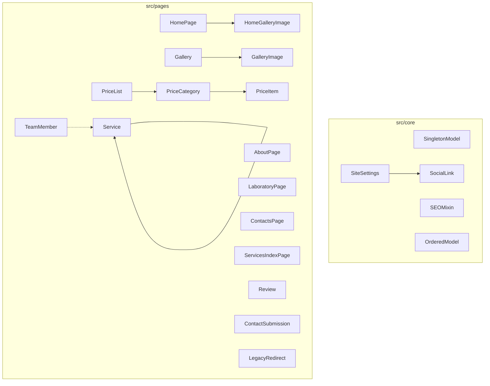

# Схема бази даних — diodi.if.ua

> Цільова архітектура Django ORM для нового сайту стоматології «ДіОДі»  
> Джерело вимог: [content/legacy/SITE-MAP.md](../content/legacy/SITE-MAP.md)  
> Поточний чернетковий код: [src/pages/models.py](../src/pages/models.py)

---

## 1. Принципи проєктування

| Принцип | Рішення |
|---------|---------|
| Структура сайту | Гібрид: singleton-сторінки + ієрархічні сутності + ordered inline |
| CMS | Без generic Page/Block на першому етапі — явні моделі під кожен розділ |
| SEO | Спільний `SEOMixin` для всіх публічних сторінок і сутностей |
| Контакти | Один `SiteSettings` — DRY для header, footer, contacts |
| Legacy URL | Окрема таблиця `LegacyRedirect` для збереження SEO |
| Apps | `src/core` — базові абстракції і налаштування; `src/pages` — контент |

---

## 2. Архітектура apps



### Розподіл файлів

| App | Файл | Моделі |
|-----|------|--------|
| `core` | `models.py` | `SingletonModel`, `SEOMixin`, `OrderedModel`, `SiteSettings`, `SocialLink` |
| `pages` | `models.py` | усі контентні моделі нижче |

---

## 3. ERD (повна схема)

```mermaid
erDiagram
    SiteSettings ||--o{ SocialLink : has
    HomePage ||--o{ HomeGalleryImage : contains
    Gallery ||--o{ GalleryImage : contains
    PriceList ||--o{ PriceCategory : has
    PriceCategory ||--o{ PriceItem : has
    Service ||--o{ Service : parent_child
    TeamMember }o--o{ Service : services_optional

    SiteSettings {
        int pk PK
        string site_name
        string phone_primary
        string phone_secondary
        string email
        string logo
        decimal latitude
        decimal longitude
    }

    HomePage {
        int pk PK
        string hero_title
        text intro_text
        string why_us_title
        text implant_description
    }

    Service {
        int id PK
        int parent_id FK
        string slug UK
        string title
        bool is_featured
        int sort_order
    }

    TeamMember {
        int id PK
        string slug UK
        string full_name
        string short_name
        string role
        int sort_order
    }

    PriceItem {
        int id PK
        int category_id FK
        string name
        string price_type
        decimal price
        decimal price_max
    }

    Review {
        int id PK
        string author_name
        text text
        bool is_published
        datetime created_at
    }

    ContactSubmission {
        int id PK
        string form_type
        string name
        string phone
        string email
        datetime created_at
    }
```

---

## 4. Базові абстракції (`src/core`)

### 4.1. `SingletonModel` (abstract)

Один запис на таблицю (pk завжди `1`).

| Поле | Django-тип | Null | Default | Примітка |
|------|------------|------|---------|----------|
| `updated_at` | `DateTimeField` | — | — | `auto_now=True` |

**Поведінка:**

- `save()` — форсує `pk=1`
- `delete()` — no-op (заборона видалення)
- `load()` — `get_or_create(pk=1)`

**Meta:** `abstract = True`

---

### 4.2. `SEOMixin` (abstract)

Спільні SEO-поля для публічних сторінок і сутностей.

| Поле | Django-тип | Null/Blank | Max | Default | Примітка |
|------|------------|------------|-----|---------|----------|
| `meta_title` | `CharField` | blank | 70 | — | fallback → `title` сторінки |
| `meta_description` | `CharField` | blank | 160 | — | |
| `og_title` | `CharField` | blank | 70 | — | fallback → `meta_title` |
| `og_description` | `CharField` | blank | 200 | — | fallback → `meta_description` |
| `og_image` | `ImageField` | blank | — | — | `upload_to='seo/'` |
| `canonical_url` | `URLField` | blank | — | — | override canonical |
| `is_published` | `BooleanField` | — | — | `True` | |
| `created_at` | `DateTimeField` | — | — | — | `auto_now_add=True` |
| `updated_at` | `DateTimeField` | — | — | — | `auto_now=True` |

**Meta:** `abstract = True`

**Рекомендації:** значення з [content/legacy/seo/recommendations.md](../content/legacy/seo/recommendations.md) при імпорті.

---

### 4.3. `OrderedModel` (abstract)

| Поле | Django-тип | Default |
|------|------------|---------|
| `sort_order` | `PositiveSmallIntegerField` | `0` |

**Meta:** `abstract = True`, `ordering = ['sort_order', 'pk']`

**Index:** `models.Index(fields=['sort_order'])`

---

## 5. Глобальні налаштування (`src/core`)

### 5.1. `SiteSettings`

**Базові класи:** `SingletonModel`, `SEOMixin`  
**Таблиця:** `core_sitesettings`  
**SITE-MAP:** G01 (logo), G02–G03 (контакти), G09 (copyright), C03–C04 (графік, карта)

| Поле | Django-тип | Null/Blank | Max | Legacy-значення |
|------|------------|------------|-----|-----------------|
| `site_name` | `CharField` | — | 100 | «Стоматологія ДіОДі» |
| `phone_primary` | `CharField` | — | 20 | (050) 537-76-57 |
| `phone_secondary` | `CharField` | blank | 20 | (067) 343-60-10 |
| `email` | `EmailField` | — | — | diodi2001@gmail.com |
| `logo` | `ImageField` | blank | — | `images/logo.jpg` |
| `address` | `CharField` | blank | 255 | — |
| `latitude` | `DecimalField` | null | 9,6 | 48.905185 |
| `longitude` | `DecimalField` | null | 9,6 | 24.680990 |
| `map_embed_url` | `URLField` | blank | — | Google Maps iframe |
| `schedule_weekdays` | `CharField` | blank | 100 | Пн–Пт 9:30–21:00 |
| `schedule_saturday` | `CharField` | blank | 100 | Сб за записом |
| `schedule_sunday` | `CharField` | blank | 100 | Нд вихідний |
| `copyright_text` | `CharField` | blank | 255 | © sd-studio.com.ua |
| `default_og_image` | `ImageField` | blank | — | fallback og:image |

**Зв'язки:** `1:N` → `SocialLink`

---

### 5.2. `SocialLink`

**Таблиця:** `core_sociallink`  
**SITE-MAP:** G06 (соцмережі), зовнішнє посилання «Лазерна епіляція»

| Поле | Django-тип | Null/Blank | Примітка |
|------|------------|------------|----------|
| `site_settings` | `ForeignKey(SiteSettings)` | — | `on_delete=CASCADE`, `related_name='social_links'` |
| `platform` | `CharField` | — | choices див. нижче |
| `label` | `CharField` | — | max 50 |
| `url` | `URLField` | — | |
| `sort_order` | `PositiveSmallIntegerField` | — | default 0 |

**Choices `platform`:**

| Value | Label | Legacy |
|-------|-------|--------|
| `instagram` | Instagram | clinicdiodi |
| `facebook` | Facebook | profile.php?id=… |
| `external` | Зовнішній ресурс | dio-lazer.if.ua |

**Constraints:**

- `UniqueConstraint(fields=['site_settings', 'platform'])` — одна запис на платформу

**Ordering:** `sort_order`, `pk`

---

## 6. Singleton-сторінки (`src/pages`)

### 6.1. `HomePage`

**Базові класи:** `SingletonModel`, `SEOMixin`  
**Таблиця:** `pages_homepage`  
**URL:** `/`  
**SITE-MAP:** H01–H07

| Поле | Django-тип | Null/Blank | Max | Блок |
|------|------------|------------|-----|------|
| `hero_title` | `CharField` | — | 255 | H01 |
| `intro_text` | `TextField` | — | — | H02 |
| `why_us_title` | `CharField` | blank | 200 | H03 заголовок |
| `why_us_text` | `TextField` | blank | — | H03 текст |
| `implant_cta_text` | `CharField` | blank | 255 | H05 |
| `implant_description` | `TextField` | blank | — | H06 |
| `implant_image` | `ImageField` | blank | — | H07, `upload_to='home/'` |

**Зв'язки:** `1:N` → `HomeGalleryImage`

---

### 6.2. `HomeGalleryImage`

**Базові класи:** `OrderedModel`  
**Таблиця:** `pages_homegalleryimage`  
**SITE-MAP:** H04

| Поле | Django-тип | Null/Blank | Примітка |
|------|------------|------------|----------|
| `home_page` | `ForeignKey(HomePage)` | — | `CASCADE`, `related_name='gallery_images'` |
| `image` | `ImageField` | — | `upload_to='home/gallery/'` |
| `alt_text` | `CharField` | blank | max 200 |

**Legacy-зображення:** IMG_5507–5509, glavnaya/g-02–05

**Index:** `(home_page, sort_order)`

---

### 6.3. `AboutPage`

**Базові класи:** `SingletonModel`, `SEOMixin`  
**Таблиця:** `pages_aboutpage`  
**URL:** `/pro-nas`  
**SITE-MAP:** A01–A03

| Поле | Django-тип | Null/Blank | Max |
|------|------------|------------|-----|
| `title` | `CharField` | — | 200 |
| `body` | `TextField` | — | — |
| `image` | `ImageField` | blank | — | `upload_to='about/'` |

---

### 6.4. `LaboratoryPage`

**Базові класи:** `SingletonModel`, `SEOMixin`  
**Таблиця:** `pages_laboratorypage`  
**URL:** `/labaratoriia`  
**SITE-MAP:** L01

| Поле | Django-тип | Null/Blank | Max |
|------|------------|------------|-----|
| `title` | `CharField` | — | 200 |
| `body` | `TextField` | — | — |
| `hero_image` | `ImageField` | blank | — | `upload_to='laboratory/'` |

**Опційно (фаза 2):** inline `LaboratoryImage` або M2M до `Gallery`.

---

### 6.5. `ContactsPage`

**Базові класи:** `SingletonModel`, `SEOMixin`  
**Таблиця:** `pages_contactspage`  
**URL:** `/kontakty`  
**SITE-MAP:** C01–C04

| Поле | Django-тип | Null/Blank | Default | Примітка |
|------|------------|------------|---------|----------|
| `title` | `CharField` | — | — | max 200 |
| `intro_text` | `TextField` | blank | — | |
| `use_site_settings` | `BooleanField` | — | `True` | телефони, email, карта з `SiteSettings` |

**DRY:** графік і координати не дублювати — читати з `SiteSettings`.

---

### 6.6. `ServicesIndexPage`

**Базові класи:** `SingletonModel`, `SEOMixin`  
**Таблиця:** `pages_servicesindexpage`  
**URL:** `/posluhy`  
**SITE-MAP:** S01–S02

| Поле | Django-тип | Null/Blank | Max |
|------|------------|------------|-----|
| `title` | `CharField` | — | 200 |
| `intro_text` | `TextField` | blank | — |

**Список напрямів у view:** `Service.objects.filter(parent__isnull=True, is_published=True)`

---

## 7. Послуги — ієрархія (`src/pages`)

### 7.1. `Service`

**Базові класи:** `SEOMixin`, `OrderedModel`  
**Таблиця:** `pages_service`  
**SITE-MAP:** S03–S06, G05 (footer — `is_featured`)

| Поле | Django-тип | Null/Blank | Max | Примітка |
|------|------------|------------|-----|----------|
| `parent` | `ForeignKey('self')` | null | — | `SET_NULL`, `related_name='children'` |
| `title` | `CharField` | — | 200 | |
| `slug` | `SlugField` | — | 100 | **unique** |
| `short_description` | `CharField` | blank | 300 | картки, меню |
| `body` | `TextField` | blank | — | |
| `image` | `ImageField` | blank | — | `upload_to='services/'` |
| `is_featured` | `BooleanField` | — | — | default `False`, footer G05 |
| `legacy_path` | `CharField` | blank | 255 | старий URL Joomla |

**Constraints:**

- `UniqueConstraint(fields=['slug'])`
- Валідація: max 2 рівні вкладеності (parent.parent is null)

**Indexes:**

- `(parent, sort_order)`
- `(is_featured)` where featured

**Дерево (legacy):**

```
terapevtychna-stomatolohiia
├── estetychna-restavratsiia
├── endodontiia-likuvannia-korenevykh-kanaliv
├── profesiina-hihiiena-rotovoi-porozhnyny
├── plombuvannia-usikh-vydiv-kariiesu
├── profesiine-vidbiliuvannia
└── likuvannia-paradontu

ortopedychna-stomatolohiia
├── neznimne-protezuvannia
└── znimne-protezuvannia

khirurhiia
implantolohiia
renthenohrafiia
3d-skanuvannya
```

**Featured (footer G05):** terapevtychna, ortopedychna, implantolohiia, renthenohrafiia

---

## 8. Команда (`src/pages`)

### 8.1. `TeamRole` (TextChoices)

| Value | Label (uk) |
|-------|------------|
| `director` | Директор |
| `chief_doctor` | Головний лікар |
| `doctor` | Лікар-стоматолог |
| `dental_technician` | Зубний технік |
| `administrator` | Адміністратор |
| `nurse` | Середній медичний персонал |

---

### 8.2. `TeamMember`

**Базові класи:** `SEOMixin`, `OrderedModel`  
**Таблиця:** `pages_teammember`  
**URL pattern:** `/pro-nas/nasha-komanda/<slug>/`  
**SITE-MAP:** T01–T03

| Поле | Django-тип | Null/Blank | Max | Примітка |
|------|------------|------------|-----|----------|
| `full_name` | `CharField` | — | 200 | «Лабій Надія Анатоліївна» |
| `short_name` | `CharField` | blank | 50 | «Лабій Н. А.» |
| `slug` | `SlugField` | — | 100 | **unique** |
| `role` | `CharField` | — | 30 | choices `TeamRole` |
| `role_title` | `CharField` | blank | 200 | для UI: «Головний лікар» |
| `bio` | `TextField` | blank | — | |
| `photo` | `ImageField` | blank | — | `upload_to='team/'` |
| `legacy_path` | `CharField` | blank | 255 | старий slug Joomla |
| `services` | `ManyToManyField(Service)` | blank | — | опційно: запис до лікаря |

**Indexes:** `(sort_order)`, `(role)`

**Початкові записи (10 осіб):**

| slug | full_name | role |
|------|-----------|------|
| `administrator` | Джус Олена Семенівна | administrator |
| `dyrektor` | Джус Олег Дмитрович | director |
| `holovnyi-likar` | Лабій Надія Анатоліївна | chief_doctor |
| `moderuk` | Мадерук Юрій Васильович | dental_technician |
| `likar-skovorodniev` | Сковороднєв Андрій Васильович | doctor |
| `dubishchak` | Дубіщак Віталія Яківна | doctor |
| `dutchak` | Дутчак Галина Миколаівна | nurse |
| `svintsytska` | Свінціцка Наталія Валеріівна | nurse |
| `basarab` | Басараб Ірина Володимирівна | nurse |
| `volochii` | Волочій Іванна Степанівна | nurse |

**Legacy 404:** dubishchak, dutchak — контент з `text/team/nasha-komanda.md`, нові slug.

---

## 9. Галерея (`src/pages`)

### 9.1. `Gallery`

**Базові класи:** `SEOMixin`  
**Таблиця:** `pages_gallery`  
**URL:** `/pro-nas/fotohalereia`  
**SITE-MAP:** F01

| Поле | Django-тип | Null/Blank | Max |
|------|------------|------------|-----|
| `title` | `CharField` | — | 200 |
| `slug` | `SlugField` | — | 50, **unique** |
| `description` | `TextField` | blank | — |

**Початковий запис:** `slug=fotohalereia`

---

### 9.2. `GalleryImage`

**Базові класи:** `OrderedModel`  
**Таблиця:** `pages_galleryimage`

| Поле | Django-тип | Null/Blank | Примітка |
|------|------------|------------|----------|
| `gallery` | `ForeignKey(Gallery)` | — | `CASCADE`, `related_name='images'` |
| `image` | `ImageField` | — | `upload_to='gallery/'` |
| `alt_text` | `CharField` | blank | max 200 |
| `caption` | `CharField` | blank | max 255 |

**Index:** `(gallery, sort_order)`

**Legacy:** ~20 файлів з `content/legacy/images/fotogalereya/`

---

## 10. Ціни (`src/pages`)

### 10.1. `PriceList`

**Базові класи:** `SingletonModel`  
**Таблиця:** `pages_pricelist`  
**URL:** `/tsiny`  
**SITE-MAP:** P01, P03

| Поле | Django-тип | Null/Blank | Default |
|------|------------|------------|---------|
| `title` | `CharField` | — | max 200 |
| `currency_label` | `CharField` | — | `'грн.'` |
| `approval_note` | `CharField` | blank | max 255 |
| `is_published` | `BooleanField` | — | `True` |

**Legacy approval_note:** «Затверджено Директор п/п «ДіОДі» О.Д. Джус»

---

### 10.2. `PriceCategory`

**Базові класи:** `OrderedModel`  
**Таблиця:** `pages_pricecategory`  
**SITE-MAP:** P02 (розділи прейскуранту)

| Поле | Django-тип | Null/Blank |
|------|------------|------------|
| `price_list` | `ForeignKey(PriceList)` | — | `CASCADE`, `related_name='categories'` |
| `title` | `CharField` | — | max 200 |

**Legacy-категорії:**

1. Терапевтичні роботи
2. Лікування каналів
3. Ортопедія
4. Хірургія

---

### 10.3. `PriceItem`

**Базові класи:** `OrderedModel`  
**Таблиця:** `pages_priceitem`

| Поле | Django-тип | Null/Blank | Примітка |
|------|------------|------------|----------|
| `category` | `ForeignKey(PriceCategory)` | — | `CASCADE`, `related_name='items'` |
| `name` | `CharField` | — | max 255 |
| `price_type` | `CharField` | — | choices див. нижче |
| `price` | `DecimalField` | null | max_digits=10, decimal_places=2 |
| `price_max` | `DecimalField` | null | для `range` |
| `note` | `CharField` | blank | max 100, напр. «Tokuyama» |

**Choices `price_type`:**

| Value | Label | Приклад legacy |
|-------|-------|----------------|
| `exact` | Точна ціна | 450.00 |
| `from` | Від | від 250.00 |
| `range` | Діапазон | — |

**Index:** `(category, sort_order)`

**Legacy:** ~40 позицій з [content/legacy/text/tsiny.md](../content/legacy/text/tsiny.md)

---

## 11. Відгуки та форми (`src/pages`)

### 11.1. `Review`

**Таблиця:** `pages_review`  
**URL:** `/vidhuky`  
**SITE-MAP:** R01

| Поле | Django-тип | Null/Blank | Default |
|------|------------|------------|---------|
| `author_name` | `CharField` | — | max 100 |
| `text` | `TextField` | — | — |
| `rating` | `PositiveSmallIntegerField` | null | — | 1–5, optional |
| `source` | `CharField` | — | choices: `manual`, `imported` |
| `is_published` | `BooleanField` | — | `False` |
| `created_at` | `DateTimeField` | — | `auto_now_add=True` |

**Moderation:** публікація лише через admin (`is_published=True`).

**Index:** `(is_published, -created_at)`

---

### 11.2. `ContactSubmission`

**Таблиця:** `pages_contactsubmission`  
**SITE-MAP:** G07 (callback), G08 (email)

| Поле | Django-тип | Null/Blank | Примітка |
|------|------------|------------|----------|
| `form_type` | `CharField` | — | choices: `callback`, `email` |
| `name` | `CharField` | — | max 100 |
| `phone` | `CharField` | blank | max 20 |
| `email` | `EmailField` | blank | — |
| `message` | `TextField` | — | — |
| `ip_address` | `GenericIPAddressField` | null | — |
| `is_processed` | `BooleanField` | — | default `False` |
| `created_at` | `DateTimeField` | — | `auto_now_add=True` |

**Validation (model clean / form):**

- `callback` → `phone` required
- `email` → `email` required

**Index:** `(is_processed, -created_at)`

---

## 12. Legacy URL (`src/pages`)

### 12.1. `LegacyRedirect`

**Таблиця:** `pages_legacyredirect`

| Поле | Django-тип | Null/Blank | Примітка |
|------|------------|------------|----------|
| `old_path` | `CharField` | — | max 255, **unique** |
| `new_path` | `CharField` | — | max 255 |
| `is_active` | `BooleanField` | — | default `True` |

**Приклади:**

| old_path | new_path |
|----------|----------|
| `/pro-nas/nasha-komanda/cerednii-medychnyi-personal-petrushka-snizhana-serhiivna` | `/pro-nas/nasha-komanda/basarab/` |
| `/pro-nas/nasha-komanda/likar-stomatoloh-dubishchak-vitaliia-yakivna` | `/pro-nas/nasha-komanda/dubishchak/` |

**Middleware/view:** 301 redirect якщо `is_active=True`.

---

## 13. Зведена таблиця зв'язків

| Зв'язок | Тип | On delete | related_name |
|---------|-----|-----------|--------------|
| SiteSettings → SocialLink | 1:N | CASCADE | `social_links` |
| HomePage → HomeGalleryImage | 1:N | CASCADE | `gallery_images` |
| Gallery → GalleryImage | 1:N | CASCADE | `images` |
| PriceList → PriceCategory | 1:N | CASCADE | `categories` |
| PriceCategory → PriceItem | 1:N | CASCADE | `items` |
| Service → Service (parent) | self 1:N | SET_NULL | `children` |
| TeamMember ↔ Service | M:N | — | `services` / `team_members` |

**Singleton (завжди 1 запис):** SiteSettings, HomePage, AboutPage, LaboratoryPage, ContactsPage, ServicesIndexPage, PriceList

---

## 14. Мапінг SITE-MAP → моделі

| Блок ID | Опис | Модель / поле |
|---------|------|---------------|
| G01 | Header | `SiteSettings.logo`, nav з `Service`, `TeamMember` |
| G02 | Footer телефони | `SiteSettings.phone_primary`, `phone_secondary` |
| G03 | Footer email | `SiteSettings.email` |
| G04 | Footer «Про нас» | hardcoded routes → AboutPage, TeamMember list, ContactsPage, Gallery |
| G05 | Footer «Послуги» | `Service.filter(is_featured=True)` |
| G06 | Соцмережі | `SocialLink` |
| G07 | Замовити дзвінок | `ContactSubmission(form_type=callback)` |
| G08 | Написати нам | `ContactSubmission(form_type=email)` |
| G09 | Copyright | `SiteSettings.copyright_text` |
| G10 | Scroll to top | UI only, без моделі |
| H01–H07 | Головна | `HomePage` + `HomeGalleryImage` |
| A01–A03 | Про нас | `AboutPage` |
| T01–T03 | Команда | `TeamMember` |
| S01–S06 | Послуги | `ServicesIndexPage` + `Service` |
| P01–P03 | Ціни | `PriceList` + `PriceCategory` + `PriceItem` |
| C01–C04 | Контакти | `ContactsPage` + `SiteSettings` |
| F01 | Фотогалерея | `Gallery` + `GalleryImage` |
| L01 | Лабораторія | `LaboratoryPage` |
| R01 | Відгуки | `Review` |

---

## 15. Відмінності від поточного `src/pages/models.py`

| Було (чернетка) | Стане (цільова схема) |
|-----------------|----------------------|
| `GeneralSettings` — 2 телефони | `SiteSettings` — повні контакти, карта, SEO |
| `InfoBlock` як Singleton | Поля рознесені по `HomePage`, `AboutPage` |
| `Gallery` як Singleton | `Gallery` + `GalleryImage` |
| `MainPage` + M2M | `HomePage` + `HomeGalleryImage` |
| — | `Service` (ієрархія) |
| — | `TeamMember` |
| — | `PriceList` / `PriceCategory` / `PriceItem` |
| — | `Review`, `ContactSubmission`, `LegacyRedirect` |

---

## 16. План імпорту з `content/legacy/` (наступний етап)

| Джерело | Цільова модель |
|---------|----------------|
| `text/home.md` | `HomePage`, `HomeGalleryImage` |
| `text/pro-nas.md` | `AboutPage` |
| `text/posluhy/*.md` | `Service` (tree) |
| `text/team/*.md` | `TeamMember` |
| `text/tsiny.md` | `PriceCategory`, `PriceItem` |
| `text/fotohalereia.md` + `images/fotogalereya/` | `Gallery`, `GalleryImage` |
| `text/labaratoriia.md` | `LaboratoryPage` |
| `text/kontakty.md` | `ContactsPage`, `SiteSettings` |
| `seo/recommendations.md` | SEO-поля всіх моделей |
| `text/index.json` | `LegacyRedirect.old_path` |

**Management command (майбутнє):** `python3 manage.py import_legacy_content`

---

## 17. Примітки для реалізації

1. **Reviews:** legacy використовував JComments — імпорт коментарів окремо або ручне наповнення через admin.
2. **Featured services:** рівно 4 записи з `is_featured=True` для footer G05.
3. **Singleton admin:** використати `SingletonModelAdmin` або inline з одним записом.
4. **MEDIA:** налаштувати `MEDIA_ROOT` / `MEDIA_URL` у settings перед імпортом зображень.
5. **Slug uniqueness:** при імпорті перевіряти конфлікти; legacy slug зберігати в `legacy_path`.
6. **TeamMember M2M:** реалізувати лише якщо потрібен запис до конкретного лікаря на новому сайті.

---

## 18. Підсумок моделей

| # | Модель | App | Тип | Таблиця |
|---|--------|-----|-----|---------|
| 1 | SingletonModel | core | abstract | — |
| 2 | SEOMixin | core | abstract | — |
| 3 | OrderedModel | core | abstract | — |
| 4 | SiteSettings | core | singleton | core_sitesettings |
| 5 | SocialLink | core | entity | core_sociallink |
| 6 | HomePage | pages | singleton | pages_homepage |
| 7 | HomeGalleryImage | pages | inline | pages_homegalleryimage |
| 8 | AboutPage | pages | singleton | pages_aboutpage |
| 9 | LaboratoryPage | pages | singleton | pages_laboratorypage |
| 10 | ContactsPage | pages | singleton | pages_contactspage |
| 11 | ServicesIndexPage | pages | singleton | pages_servicesindexpage |
| 12 | Service | pages | tree | pages_service |
| 13 | TeamMember | pages | entity | pages_teammember |
| 14 | Gallery | pages | entity | pages_gallery |
| 15 | GalleryImage | pages | inline | pages_galleryimage |
| 16 | PriceList | pages | singleton | pages_pricelist |
| 17 | PriceCategory | pages | inline | pages_pricecategory |
| 18 | PriceItem | pages | inline | pages_priceitem |
| 19 | Review | pages | entity | pages_review |
| 20 | ContactSubmission | pages | entity | pages_contactsubmission |
| 21 | LegacyRedirect | pages | entity | pages_legacyredirect |

**Всього:** 21 модель (3 abstract + 7 singleton + 11 entity/inline)
